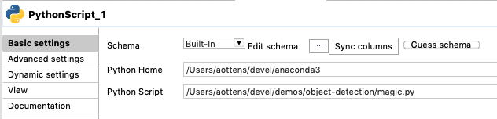
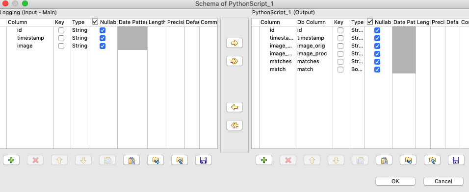

# Severus Snake - A Talend Component for Python
**Disclaimer:** This component is not an official contribution from Talend

## Overview
This projects aims to provide a component for Talend Studio that let's you use Python as part of your Talend Jobs.
Python is among the most popular programming languages, especially when it comes to data science, AI/ML and so on.
With this in mind it is not surprising questions on how to leverage Python with Talend come up on a regular basis.
As there is currently no Talend Studio Component for Python I created my own using the [Talend Component Kit](https://talend.github.io/component-runtime/).

You will find many libraries searching for Java and Python integration and the most well-known is probably Jython, but this has the disadvantage that you can't use Python libraries like numpy that are written in CPython. For this component I wanted to be able to use my favorite Python libraries as I would in a pure Python environment. During my research I came across [JEP](https://github.com/ninia/jep) which solves that problem and let me use the full power of Python like object detection for example. The image below shows object detection done by a Talend Job using this component.


## Requirements
In order to use this component you need to provide to requirements:

* Python Installation
* JEP Python Library

### Python Installation
You need at least one installation of Python that will be used by the component to execute your Python code. The component does not ship its own Python installation. I suggest using Anaconda for setting up and managing your Python environments.

You will configure the component with the path to you Python installation and during runtime the component will invoke this environment.

### JEP Python Library

This library is the connection between Java and Python. For this connection to work, you need to install the JEP library into the Python installation you want to use.

**IMPORTANT:** If you want to use multiple Python installations, every Python installation will need this library!

## Installation
### From Source
To install this component from source, first check it out and then run the Maven goal to install the component into your Studio installation:

```bash
git clone https://github.com/ottensa/severus-snake
cd severus-snake
mvn clean package talend-component:deploy-in-studio -Dtalend.component.studioHome="/path/to/talend/studio"
```

### Release
Alternatively you can download a release from [here](https://github.com/ottensa/severus-snake/releases) and then execute the car file to install the component into your Studio installation:

```bash
java -jar severus-snake-0.0.1.car studio-deploy /path/to/talend/studio
```

## Usage

Now that all requirements are fulfilled and the component is installed into your Studio, you can use the component as part of you Standard Data Integration Jobs. The component has two configuration items:

* Python Home: The path to the Python installation that shall be used.
* Script: The path to the script that you want to run.



In order to get data in and out of the component there are two dictionaries you ca use in your Python script:

* ```input```: For data coming into to the component
* ```output```: For data going out of the component 

The keys of the dictonaries are the column names as defined in the schema of the component.

**Example**



```python
import cv2
import numpy as np
...
output['id'] = input['id']
output['timestamp'] = input['timestamp']
output['image_orig'] = input['image']
output['image_proc'] = str(jpg_as_text, 'utf-8')
output['matches'] = json.dumps(matches)
output['match'] = len(matches) > 0
```
